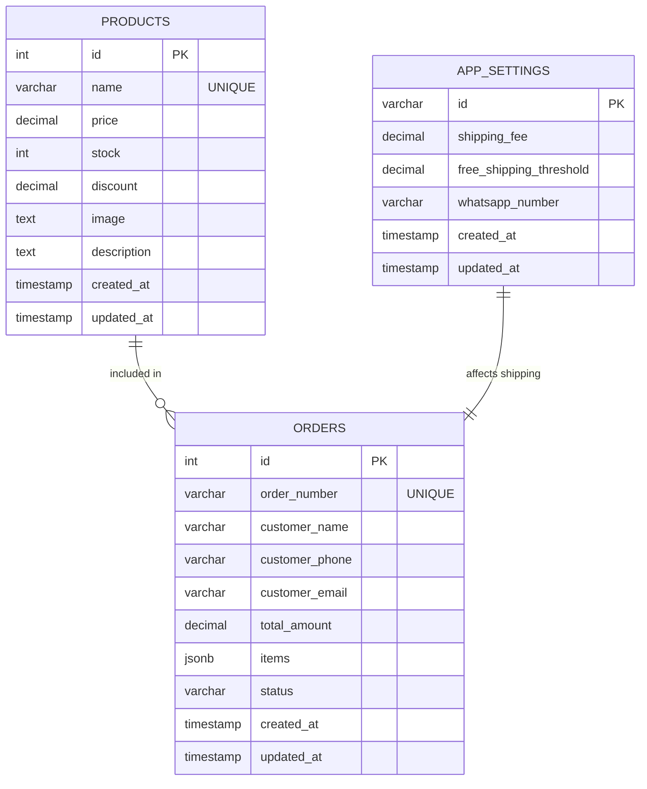

# PetFood Mart

PetFood Mart 是一個寵物食品線上商店範例，前端使用 Vue 3 CDN，後端使用 Node.js / Express，資料庫使用 PostgreSQL。

目前專案已切到本地 API 模式，實際運作流程是：

使用者介面 -> Vue 3 -> Express API -> PostgreSQL

## 功能

- 商品瀏覽與搜尋
- 購物車與金額計算
- 配送方式：自取、宅配、自訂配送
- WhatsApp 下單
- PDF 收據下載
- 管理後台：商品 CRUD、運費與免運門檻設定
- 中英文切換

## 技術棧

### 前端

- Vue 3 CDN
- Tailwind CSS
- FontAwesome 6
- jsPDF

### 後端

- Node.js / Express
- PostgreSQL 15
- JWT
- bcryptjs
- joi
- express-rate-limit
- morgan

## 專案結構

```text
my-pet-shop/
├── index.html
├── README.md
├── docker-compose.yml
├── backend/
│   ├── server.js
│   ├── package.json
│   ├── .env
│   └── db/
│       ├── init.sql
│       ├── migrate.js
│       ├── migration_001_init_schema.sql
│       └── seed_products.sql
├── 中優先度改進總結.md
└── 優化報告.md
```

## 資料庫設計

目前有 3 張表。

### ER 圖



說明：

- `products` 是商品主表
- `app_settings` 保存單一站點設定
- `orders` 保存訂單與 JSONB 明細
- 目前 `orders.items` 以 JSONB 方式保存購物車內容，沒有再拆成獨立 order_items 表

### products

商品主表。

- `id`：主鍵
- `name`：商品名稱，唯一
- `price`：價格
- `stock`：庫存
- `discount`：折扣百分比
- `image`：圖片網址
- `description`：商品描述
- `created_at` / `updated_at`：時間戳

### app_settings

網站設定表，目前以單筆 `main` 記錄為主。

- `id`：主鍵
- `shipping_fee`：標準運費
- `free_shipping_threshold`：免運門檻
- `whatsapp_number`：店家 WhatsApp
- `created_at` / `updated_at`：時間戳

### orders

訂單表。

- `id`：主鍵
- `order_number`：訂單號，唯一
- `customer_name`：顧客姓名
- `customer_phone`：顧客電話
- `customer_email`：顧客 Email
- `total_amount`：總金額
- `items`：JSONB 訂單明細
- `status`：訂單狀態
- `created_at` / `updated_at`：時間戳

### 索引

- `products(name)`
- `products(created_at)`
- `products(stock)`
- `products(price)`
- `app_settings(id)`
- `orders(order_number)`
- `orders(customer_email)`
- `orders(status)`
- `orders(created_at)`

## 啟動方式

### 1. 啟動資料庫與後端

```bash
docker compose up -d
```

如果你是在 Windows 本機直接跑，也可以先確認 PostgreSQL 容器已啟動，後端會連到 `localhost:5432`。

### 2. 啟動前端

直接用瀏覽器開 `index.html` 對應的本機伺服器網址，例如：

- `http://localhost:3000`
- 或 `http://192.168.47.1:3000`

### 3. 後端 API

- 健康檢查：`http://localhost:3001/health`
- 商品：`http://localhost:3001/api/products`
- 設定：`http://localhost:3001/api/settings`

## 管理員帳號

- 帳號：`admin`
- 密碼：`admin`

## 環境變數

### backend/.env

```env
DB_USER=postgres
DB_PASSWORD=postgres
DB_HOST=localhost
DB_PORT=5432
DB_NAME=petfood

JWT_SECRET=petfood-mart-secret-key-2024
PORT=3001
NODE_ENV=development
ALLOWED_ORIGINS=http://localhost:3000,http://127.0.0.1:3000,http://192.168.47.1:3000
```

## 目前實際狀態

- 商品列表可從 API 讀取
- 購物車可新增、調整、刪除
- 管理登入可用
- 商品新增、刪除、設定儲存可用
- PDF 收據可輸出英文版與流水號
- WhatsApp 入口可用，但需先設定號碼

## 備註

- 這份專案目前以本地 PostgreSQL + Express 為主，不是 Supabase 連線版本。
- `js/` 目錄保留的是早期模組化版本的參考資料，實際執行以 `index.html` 內嵌程式碼為準。
